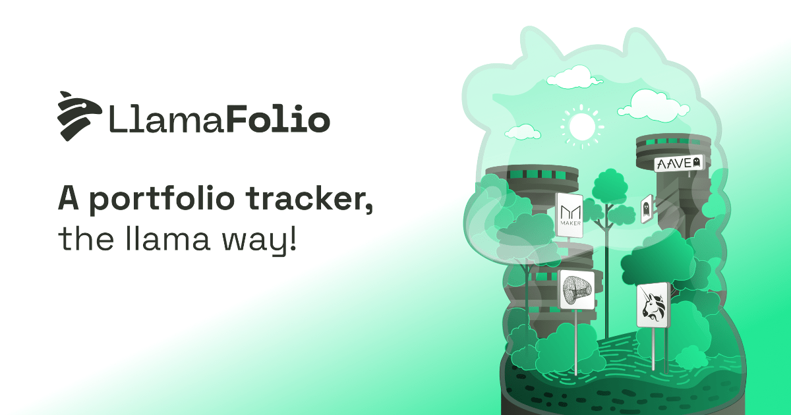

# LlamaFolio API

> Open source, permissionless, privacy conscious portfolio tracker by [Llama Corp](https://llama-corp.com/).



<br>
<h5 align="center">
  <a href="https://beta.llamafolio.com">Website</a> ⁃
  <a href="https://docs.llamafolio.com">Docs</a> ⁃
  <a href="https://discord.llamafolio.com">Discord</a> ⁃
  <a href="https://twitter.com/LlamaFolio">Twitter</a>
</h5>
<br>

## Prerequisites

- [pnpm v8+](https://pnpm.io/installation)
- [Node.js LTS (v18+)](https://nodejs.org/en/download/)

```sh
npm install --global pnpm
# if already installed, update to latest
pnpm add --global pnpm@latest
```

## Adapters

An adapter specifies how to resolve the balances of an address for your protocol.

To learn more about adapters, check our [docs](https://docs.llamafolio.com).

To test your adapter, run the command below which will output most details an adapter can find:

```bash
pnpm run adapter wallet ethereum 0x0000000000000000000000000000000000000000
```

Find your protocol in `/src/adapters` and try with any address:

```bash
pnpm run adapter {adapter_id} {chain} {address}
```

## Contributing and listing your protocol

To start contributing to the project, read our [docs](https://docs.llamafolio.com) for guided tutorials and check the instructions here:

- [Follow those instructions](./docs/contributing.md) to create your adapter and list your protocol on LlamaFolio, most adapters can be created in under an hour!

## License

[GPL-3.0](./LICENSE)
